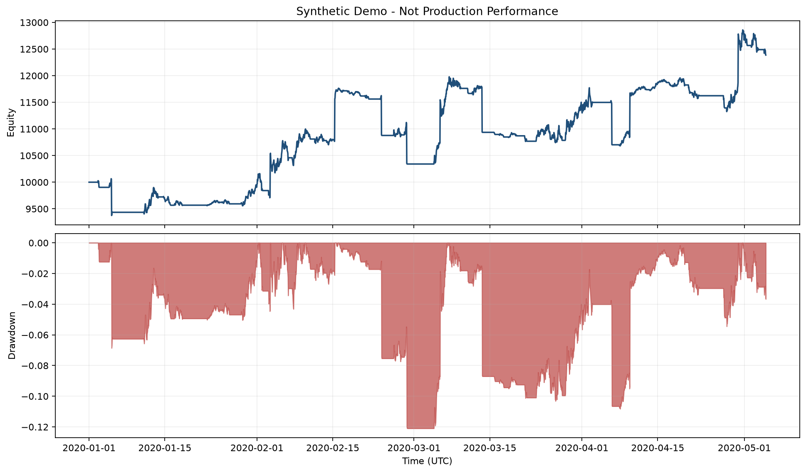

# Quant Backtest Lab

A Python-first research and backtesting lab demonstrating reproducible data processing, event-driven simulation, performance analysis, testing, and reporting.

> **Proprietary boundary**
>
> The production strategy, proprietary parameters and credentials are intentionally excluded from this repository. The included strategy is a synthetic teaching example and is unrelated to any private production system.

## Why this project exists

Quantitative research is easy to make look convincing and difficult to make reproducible. This project focuses on the engineering around a strategy instead of promoting a particular trading idea:

- explicit OHLCV data contracts and validation
- deterministic synthetic fixtures for tests and demos
- reusable, tested indicator functions
- next-open execution to avoid common look-ahead errors
- fractional-share paper simulation with fees, slippage, and turnover
- risk and performance statistics
- round-trip trade analysis
- reproducible plots and machine-readable metrics
- a clean CLI, type checking, linting, and CI

The public strategy is a long-only SMA crossover. Its parameters are demonstration defaults and are not production settings.


## Quick start

```bash
git clone https://github.com/11zihaoxu/quant-backtest-lab.git
cd quant-backtest-lab

python -m venv .venv
source .venv/bin/activate  # Windows: .\.venv\Scripts\Activate.ps1
python -m pip install -e ".[dev]"

python -m quantlab demo --config configs/demo.yaml --output results/demo
```

Expected output is a JSON metric summary plus these files:

```text
results/demo/
├── dataset.csv
├── equity.csv
├── trades.csv
├── metrics.json
└── equity_and_drawdown.png
```

The dataset is synthetic. The displayed metrics are demonstration artifacts and do not imply future performance.

## Architecture

```text
Local CSV or synthetic OHLCV
          |
          v
  validation and transforms
          |
          v
   indicator functions
          |
          v
  strategy target weights
          |
          v
 next-open paper backtest
   |       |       |
   |       |       +--> trade ledger
   |       +----------> fees and turnover
   +------------------> equity series
          |
          v
 metrics, JSON, CSV, charts
```

See [docs/architecture.md](docs/architecture.md) for module boundaries.

## Demo results



The chart is generated from deterministic synthetic data by the same CLI shown above. It is not a historical backtest and is not a performance claim.

## Commands

Run the complete synthetic demo:

```bash
python -m quantlab demo --config configs/demo.yaml --output results/demo
```

Backtest the demo strategy on a validated CSV:

```bash
python -m quantlab backtest --data data/example.csv --config configs/demo.yaml
```

Alternatively, place a validated CSV under `data/` and run the demo strategy on it. The repository does not fetch market data over the network by default.

## Data contract

A CSV must contain a `timestamp` column plus:

```text
open, high, low, close, volume
```

Timestamps are interpreted as UTC. The validator checks ordering, duplicates, null values, numeric values, positive prices, non-negative volume, and OHLC consistency. See [docs/data_contract.md](docs/data_contract.md).

## Backtest assumptions

- Signals are generated at bar close and executed at the next bar open.
- The demo strategy is long-only and uses fractional shares.
- Fees and slippage are explicit basis-point inputs.
- Volume and market impact are not modeled in the public example.
- The public engine is intentionally small and is not a production order-management system.

See [docs/backtest_assumptions.md](docs/backtest_assumptions.md) for the full boundary.

## Quality checks

```bash
ruff check .
mypy src
pytest
```

The test suite includes data validation, deterministic fixtures, indicator behavior, strategy warm-up, next-open execution, costs, metrics, CLI artifacts, and repository publication boundaries.

## Project structure

```text
configs/              Demo configuration
src/quantlab/data/    Loading, validation, transforms, synthetic data
tests/                 Unit and boundary tests
src/quantlab/indicators/  Reusable indicator functions
src/quantlab/strategies/  Public demonstration strategy
src/quantlab/backtest/    Paper execution and result models
src/quantlab/metrics/     Risk and trade statistics
src/quantlab/reporting/   Plot generation
examples/               Minimal runnable examples
docs/                   Architecture and research notes
data/                   Local ignored datasets
results/                Local ignored outputs
```

## Research methodology

The repository deliberately stops at a reproducible research boundary. A production workflow would add:

- dataset versioning and lineage
- walk-forward or rolling-origin validation
- multiple-testing controls
- market-impact and fill-probability assumptions
- live order, reconciliation, and incident-management systems

Those additions are described conceptually in [docs/research_method.md](docs/research_method.md), but no proprietary research answer is published here.

## Security

Never commit credentials, account exports, private keys, or live order data. See [SECURITY.md](SECURITY.md), [docs/publication_boundary.md](docs/publication_boundary.md), and [docs/release_hygiene.md](docs/release_hygiene.md).

## License

MIT. See [LICENSE](LICENSE).

## 中文简介

这是一个 Python 量化研究与回测工程作品集，重点展示数据处理、事件驱动模拟、统计评估、可视化、测试和工程化能力。仓库中的双均线策略只是教学 Demo，真实生产策略、专有参数、凭据、实盘执行配置和私有数据均被有意排除。
