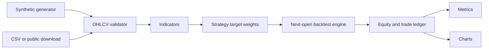

# Architecture

## Design goals

1. Keep data, indicators, strategies, execution, metrics, and reporting separate.
2. Make timing assumptions explicit and testable.
3. Keep the public example independent from any private production strategy.
4. Prefer deterministic fixtures over committed market datasets.

## Data flow

## Module boundaries

| Module | Responsibility |
|---|---|
| `quantlab.data` | I/O, validation, resampling, synthetic fixtures |
| `quantlab.indicators` | Pure functions for technical indicators |
| `quantlab.strategies` | Target-weight generation only |
| `quantlab.backtest` | Paper fills, costs, turnover, trade ledger |
| `quantlab.metrics` | Risk, return, and trade statistics |
| `quantlab.reporting` | Charts and report assets |
| `quantlab.pipeline` | End-to-end composition |

The strategy layer does not know about cash, orders, or fills. The engine does not contain strategy-specific logic. Reporting consumes immutable result objects.
